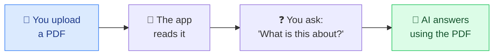
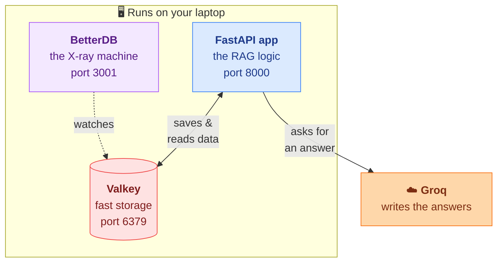
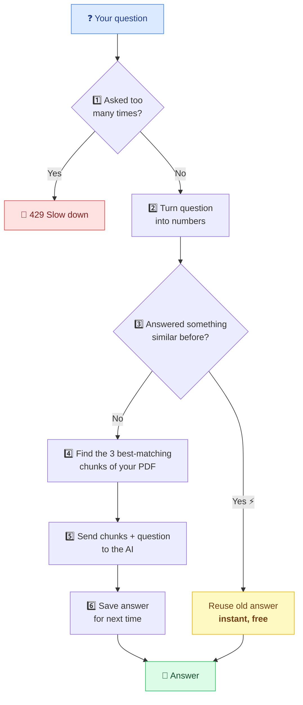
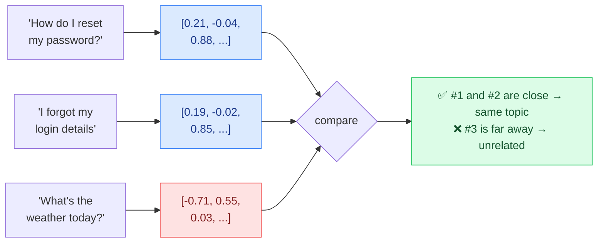
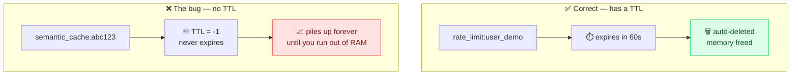

<br><div align="center">


# BetterDB × Krish Naik Academy

### *AI Infrastructure Observability — RAG Pipeline Demo*

**"Your AI App's Redis is Broken — And You Don't Know It"**

*A collaboration between [BetterDB](https://betterdb.com) and [Krish Naik](https://www.youtube.com/@krishnaik06)*

[📺 Watch the Video](https://www.youtube.com/watch?v=Wh3k3CelSbQ) · [📖 Full Step-by-Step Guide](step-by-step.md) · [🌐 BetterDB](https://betterdb.com)

</div>

---

# Part 1 — For Beginners

**New here? Start with this section.** It explains what this project is, using plain language and diagrams. If you already know RAG and Redis, skip to [Part 2 — Quick Start](#part-2--quick-start).

## What does this project actually do?

You upload a **PDF**. Then you **ask questions about it**, and an AI answers using only what's in that PDF.

That's it. That's the app.



This technique is called **RAG** — *Retrieval-Augmented Generation*. Three words, one idea:

| Word | Meaning |
|---|---|
| **Retrieval** | Go *find* the relevant pieces of your PDF |
| **Augmented** | *Add* those pieces to the question |
| **Generation** | The AI *writes* an answer from them |

Why bother? Because an AI model has never seen your PDF. Ask it directly and it will guess. RAG hands it the right page first, so the answer comes from your document instead of the model's imagination.

## But this project has a second, sneakier purpose

The RAG app is real and works — but it's also **bait**. It was written with **deliberate bugs** so you can watch a monitoring tool (**BetterDB**) catch them.

The bugs are the kind that don't crash anything. Your app looks perfectly healthy while slowly eating all your memory. Those are the dangerous ones, and they're what this demo is really about.

> **In one sentence:** a working PDF-question-answering app, intentionally built with realistic memory leaks, so you can learn to spot them.

## The three pieces



**1. Valkey** — the storage. It's an open-source twin of **Redis**, so the two names get used interchangeably here. Think of it as a giant notebook that lives in memory: incredibly fast to read and write, but everything in it disappears if you don't manage it carefully. It holds your PDF chunks, cached answers, and chat history.

**2. The FastAPI app** — the brain. Chops up PDFs, decides what's relevant, talks to the AI.

**3. BetterDB** — the X-ray machine. It watches Valkey and shows you what's really happening inside: which keys are huge, which commands are slow, what's leaking. Without it, Valkey is a black box.

Only the AI itself is remote. **Everything else runs on your machine.**

## How one question flows through the system

Here's what happens between you hitting Enter and seeing an answer:



Every one of those numbered steps is real code in [rag/pipeline.py](rag/pipeline.py) — the `query_rag` function follows exactly this order.

### The one concept worth pausing on: embeddings

Steps 2–4 rely on a trick that trips up most beginners, so here it is slowly.

Computers can't compare *meaning*. So we convert every piece of text into a **list of 384 numbers** that captures what it means. That list is called an **embedding**, or a **vector**.

The useful property: **similar meanings produce similar numbers.**



The first two sentences share no words at all, yet mean nearly the same thing — and their numbers land close together. That's the magic. Measuring "how close" is done with **cosine similarity**, a score from 0 (unrelated) to 1 (identical). It's about five lines of math, in [rag/pipeline.py:39](rag/pipeline.py#L39).

This one idea powers two features here: finding relevant PDF chunks (step 4), and noticing you've asked a similar question before (step 3).

**In this project, embeddings are computed on your own laptop** by a small model called `fastembed` — no API, no key, no cost.

## Now — the bugs you're here to find

Valkey lets you put an **expiry** on anything you store, called a **TTL** (*time to live*). It's a self-destruct timer: "delete this after 1 hour." No TTL means **keep forever**.



This app sets a TTL on exactly one of its four data types. The other three grow forever:

| What's stored | Written by | TTL | Verdict |
|---|---|---|---|
| `rate_limit:user_{id}:minute` | `/query` | 60s | ✅ correct |
| `rag:doc:{sha256}` — PDF chunks | `/ingest` | **none** | ❌ leaks |
| `semantic_cache:{md5}` — cached answers | `/query` | **none** | ❌ leaks |
| `langchain:memory:session:{id}` — chat history | `/query` | **none** | ❌ leaks |

**Nothing breaks.** No error, no failed request, no alert. Memory just climbs — for weeks — until one night the server dies and nobody knows why.

That's the lesson. Spotting this needs a tool that shows you TTLs and key sizes, which is exactly what BetterDB does at `localhost:3001`.

## What you'll need

| Thing | Why | Cost |
|---|---|---|
| **Docker Desktop** | runs Valkey | free |
| **Python 3.12+** and [`uv`](https://docs.astral.sh/uv/) | runs the app | free |
| **Node.js** | runs the BetterDB dashboard | free |
| **A Groq API key** | writes the answers — [get one here](https://console.groq.com/keys) | free tier |
| **Any PDF** | something to ask questions about | — |

No OpenAI key needed. Groq's free tier covers this comfortably, and embeddings run locally.

👉 **Ready? Go to [Part 2 — Quick Start](#part-2--quick-start).**

---

# Part 2 — Quick Start

## The Problem (the professional version)

You ship a RAG pipeline. It uses Redis for semantic caching, agent memory, and rate limiting. Three weeks later:

- A LangChain agent runs overnight — **10,000 HSET commands** on one session key
- Your semantic cache grows to **450 MB** — nobody set TTLs
- Someone hits your LLM rate limiter **10,000+ times in 30 seconds**
- RAG pipeline p95 latency creeps up — **HGETALL is the bottleneck**, invisible in aggregate

You open CloudWatch. You see a spike. **The Redis slowlog is already overwritten** — 128 entries, gone in 0.1 seconds at 1,000 cmd/s.

**BetterDB persists everything. Query it hours later, in plain English, from Claude Code.**

## What's in This Repo

A minimal **FastAPI RAG application** that generates real Redis keys so BetterDB has actual data to monitor — no fake seeding, no mock data.

```
betterdb-yt-collab/
├── rag/
│   ├── config.py       ← settings + Redis, Groq, and local-embedding clients
│   ├── pipeline.py     ← ingest, retrieve, semantic cache, rate limit, session
│   └── main.py         ← FastAPI: POST /ingest  POST /query  GET /stats  GET /health
├── docker-compose.yml  ← local Valkey
├── step-by-step.md     ← full demo walkthrough with all commands
├── .env.example        ← credential template
└── pyproject.toml      ← Python dependencies
```

## Redis Key Patterns Generated

| Key Pattern | Written by | TTL | BetterDB Feature |
|---|---|---|---|
| `rag:doc:{sha256}` | `POST /ingest` | **None — the bug** | Feature 2, 5 |
| `semantic_cache:{md5}` | `POST /query` | **None — the bug** | Feature 2 |
| `rate_limit:user_{id}:minute` | `POST /query` | 60s ✓ | Feature 4 |
| `rate_limit:user_{id}:hour` | `POST /query` | 3600s ✓ | Feature 4 |
| `langchain:memory:session:{id}` | `POST /query` | **None — the bug** | Feature 3 |

## Setup

### 1. Install dependencies

```bash
uv sync
```

### 2. Configure .env

```bash
cp .env.example .env
```

Fill in your Groq key — everything else already defaults to local:

```dotenv
GROQ_API_KEY=gsk_your_key_here
REDIS_URL=redis://localhost:6379
```

### 3. Start Valkey

```bash
docker-compose up -d   # start Valkey
docker-compose ps      # confirm it's healthy
```

### 4. Start BetterDB locally

```bash
npx @betterdb/monitor
```

The wizard asks for your database — accept the defaults (`localhost`, port `6379`). Dashboard lands at **http://localhost:3001**.

> **Storage note:** if it fails with *"SQLite storage is not available in this build"*, edit `~/.betterdb/config.json` and set `"storage": { "type": "memory" }`. Metrics work fine; history just won't survive a restart.

### 5. Start FastAPI

```bash
uv run uvicorn rag.main:app --reload --port 8000
```

Check it's alive: `curl localhost:8000/health`

### 6. Ingest a PDF

```bash
curl -F "file=@your-document.pdf" \
     -H "X-User-ID: demo" \
     http://localhost:8000/ingest
```

> First run downloads ~130 MB of embedding weights, then caches them. Later runs are instant.

### 7. Query

```bash
curl -X POST http://localhost:8000/query \
     -H "Content-Type: application/json" \
     -H "X-User-ID: demo" \
     -d '{"query": "What is this document about?", "session_id": "default"}'
```

**Run it twice.** The second response comes back with `"cache_hit": true` and a far lower `latency_ms` — that's the semantic cache doing its job.

Then open **http://localhost:3001** and inspect the keys you just created.

## 5 BetterDB Features Demonstrated

### Feature 1 — MCP Server: Debug in Plain English

Ask Claude Code questions — BetterDB answers from real Redis data:

```
"What are the slowest commands in the last 24h?"
"Show me memory breakdown by namespace"
"Who are the top clients by command count?"
"Show me any anomalies detected"
```

### Feature 2 — Semantic Cache TTL Bug

After `/ingest` + `/query`:
- `rag:doc:*` — 21 keys, ~31 KB each, **TTL = -1**
- `semantic_cache:*` — 1+ keys, **TTL = -1**

Memory grows unbounded. No CloudWatch alert fires.

**Fix:** `r.expire(cache_key, 604800)` — 7 days TTL.

### Feature 3 — Agent Memory Runaway

Run multiple queries with the same `session_id`:
- Key count stays **1** (one HASH key)
- Memory grows per query: 850B → 2KB → 4KB → ...
- **TTL = -1** — grows forever

This is the sneakiest one: key *count* never rises, so any alert watching key count stays silent.

### Feature 4 — Rate Limiter Burst Detection

Fire 20 parallel requests — queries 11–20 return `HTTP 429`:

```bash
curl ... &
curl ... &
# × 20
wait && echo "done"
```

See full burst command in [step-by-step.md](step-by-step.md) Section 6.

### Feature 5 — HGETALL Latency Attribution

`retrieve_docs` in [rag/pipeline.py:170](rag/pipeline.py#L170) runs `HGETALL` on *every* stored chunk, one round-trip each:

```
Per-key HGETALL (cloud Redis):    avg=264ms   p95=272ms
Full scan 21 keys (cloud):        ~6000ms     ← Redis is the bottleneck
Full scan 21 keys (local Valkey): ~5ms        ← 1200× faster
```

**Fix:** Pipeline all HGETALLs into one round-trip: `~6000ms → ~300ms`.

## Troubleshooting

| Symptom | Cause | Fix |
|---|---|---|
| `ValidationError: groq_api_key Field required` | no key in `.env` | add `GROQ_API_KEY=` |
| `Connection refused` on 6379 | Valkey not running | `docker-compose up -d` |
| Dashboard empty | no data in Redis yet | run `/ingest` then `/query` |
| `404 No documents ingested yet` | queried before ingesting | run `/ingest` first |
| Odd/irrelevant answers | stale keys from a different embedding model | `docker exec betterdb-demo-valkey valkey-cli FLUSHALL`, re-ingest |
| `Cannot find module '@betterdb/shared'` | known bug in the `betterdb/agent` Docker image | use `npx @betterdb/monitor` instead |

## Full Walkthrough

See **[step-by-step.md](step-by-step.md)** for all curl commands, MCP questions, troubleshooting, and before/after fix comparisons.

## Stack

| Component | Choice |
|---|---|
| API | FastAPI 0.120 |
| LLM | Groq — Llama 3.3 70B |
| Embeddings | `fastembed` / BAAI-bge-small-en-v1.5 (local, 384-dim) |
| Storage | Valkey 8.1 (Docker) |
| Observability | BetterDB (local, `npx @betterdb/monitor`) |
| MCP | BetterDB MCP → Claude Code |
| Package manager | uv |

## License

MIT — free to use, modify, distribute.

---

<div align="center">

**Built by [Krish Naik](https://github.com/krishnaik06) in collaboration with [BetterDB](https://betterdb.com)**

[🌐 betterdb.com](https://betterdb.com) · [📺 Krish Naik Academy](https://www.youtube.com/@krishnaik06)

</div>
